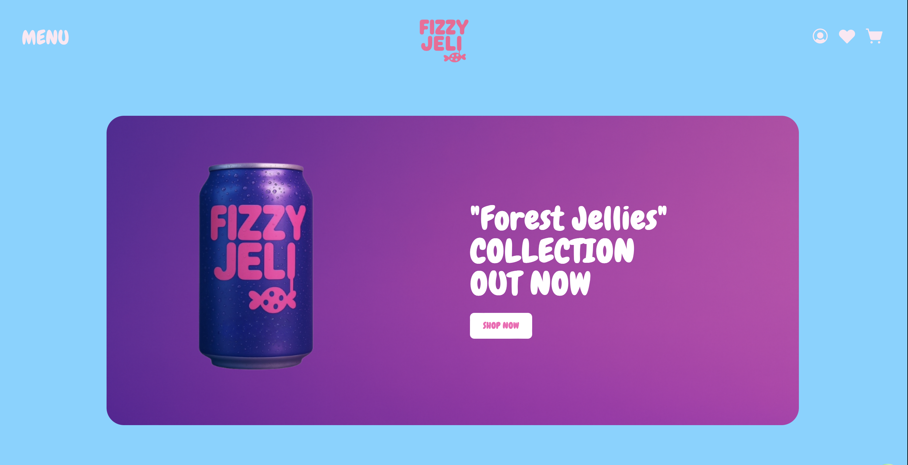
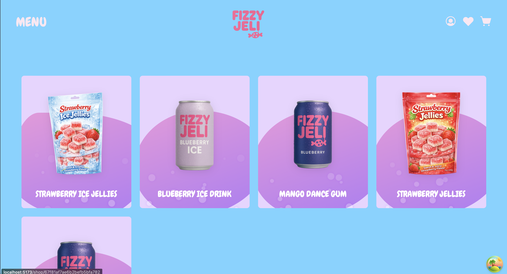

# fizzy-jeli 🍇

A full stack e-shop built with React + Tailwind for frontend with creative design and node/express.js + MongoDB for backend. You can find the backend code + documentation [here](https://github.com/pagiannis/fizzy-jeli-api.git)

---

## Screenshots

<table>
  <tr>
    <td>
      
    </td>
    <td>
      
    </td>
  </tr>
</table>

---

## ✨ Features

- Interactive Jelly-UI animations
- Simple, modern design
- Built using React, Vite, and Tailwind CSS

---

## 🚀 Tech Stack

- [React](https://reactjs.org/)
- [Vite](https://vitejs.dev/)
- [Tailwind CSS](https://tailwindcss.com/)
- TypeScript
- react-hook-form
- axios
- react-router

---

## 📁 Folder Structure

fizzy-jeli/
├── public/
├── src/
│ ├── components/
│ ├── assets/
│ ├── App.jsx
│ └── main.jsx
├── index.html
├── vite.config.js
└── README.md

---

## Backend Code URL

https://github.com/pagiannis/fizzy-jeli-api

---
