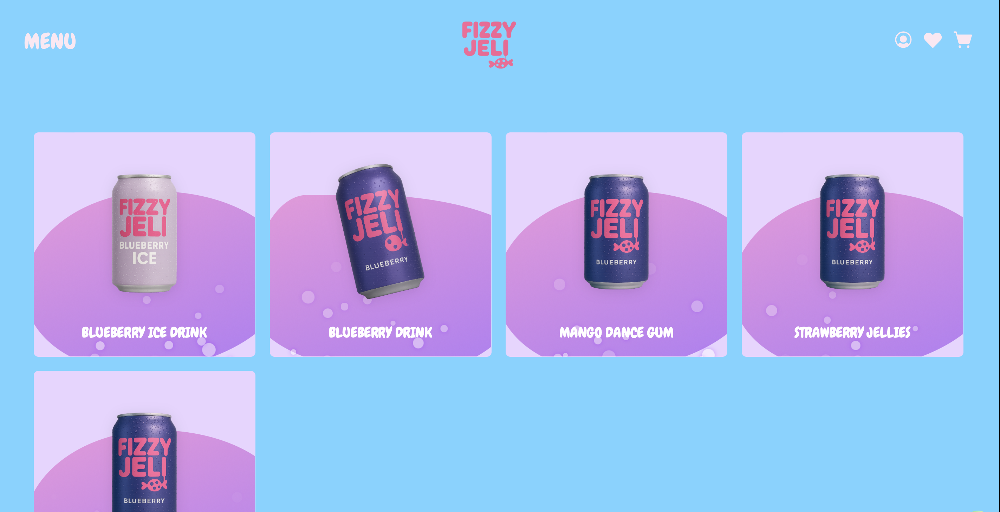

# fizzy-jeli

A full stack e-shop built with React + Tailwind for frontend with creative design and node/express.js + MongoDB for backend. You can find the backend code + documentation [here](https://github.com/pagiannis/fizzy-jeli-api.git).

---

## Screenshots

<table>
  <tr>
    <td>
    <figure>
      
      <figcaption align="center"><em>Homepage</em></figcaption>
    </figure>
    </td>
    <td>
    <figure>
      
      <figcaption align="center"><em>Shop</em></figcaption>
    </figure>
    </td>
  </tr>
</table>

---

## Features

- **Dynamic Forms with Validation**: Built using [react-hook-form](https://react-hook-form.com/) and [zod](https://github.com/colinhacks/zod) for fast, reliable, and typesafe form handling.
- **Server Communication**: Uses [react-query](https://tanstack.com/query/v5/docs/framework/react/overview) and [axios](https://axios-http.com/docs/intro) to handle data fetching, mutations, and caching with automatic retries and error handling.
- **Responsive and Modern Design**: Interactive Jelly-UI animations and responsive, modern UI design.
- **Routing**: Client-side routing is handled through [react-router-dom](https://reactrouter.com).
- **Reusable UI Components**: Custom-designed and reusable components for consistency and modularity across the app.
- **Clean Architecture**: The app meets the demands of the **sOc (Separation of Concerns)** protocol, with logic cleanly separated between UI, logic, and data layers.

---

## 🚀 Tech Stack

- React
- Vite
- Tailwind CSS
- TypeScript
- React Hook Form
- Axios
- React Router DOM
- Zod
- React Query

---

## Backend Code URL

https://github.com/pagiannis/fizzy-jeli-api

---

## Quick Start

1. **Clone the project**:

```bash
git clone https://github.com/pagiannis/fizzy-jeli.git
cd fizzy-jeli
```

2. **Install dependencies**:

```bash
npm install
```

3. **Set up the backend**:

This project depends on a separate backend API. You can find it here:
[fizzy-jeli-api](https://github.com/pagiannis/fizzy-jeli-api).

Follow the setup instructions in that repository to start the API server locally (usually runs at http://localhost:3000 or similar).

Make sure the backend is running before starting the frontend.

4. **Set up .env file**:

Create a .env file inside the fizy-jeli folder with the following:

```env
VITE_API_CLIENT_BASE_URL = 'http://localhost:3000/api'
FRONTEND_BASE_URL = 'http://localhost:5173'
```

5. **Run the app**:

```bash
npm run dev
```

---

## Author

Made by Papadopoulos Giannis

---
